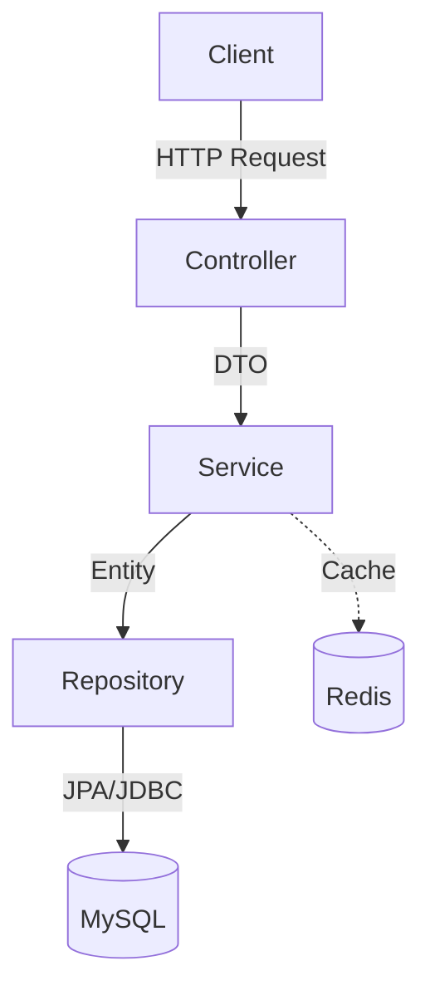

# 시스템 아키텍처 

## 1. 개요 

본 시스템은 **Spring Boot**로 구축된 모놀리식 `RESTful API` 서버이며, **Docker** 기반의 컨테이너 환경에 배포됩니다. 데이터 영속성을 위해 **MySQL**을 사용하며, 캐싱 및 세션 관리를 위해 **Redis**를 활용합니다.

### 주요 컴포넌트

- **Client**: 웹 브라우저, 모바일 앱 (API 사용자)
- **Application Server**: Spring Boot 3.4.0 (내장 Tomcat)
- **Database**: MySQL 8.0
- **CacheStore**: Redis (7.x)
- **Logging**: Logstash -> Elasticsearch -> Kibana (ELK Stack)

## 2. 소프트웨어 아키텍처

이 애플리케이션은 관심사의 분리를 보장하기 위해 표준 Spring Boot 계층형 아키텍처를 따릅니다.

### 2.1 프레젠테이션 계층 (`domain.*.controller`)
- 들어오는 HTTP 요청을 처리합니다.
- `DTO`와 `@Valid`를 사용하여 입력 데이터를 검증합니다.
- 비즈니스 로직을 서비스 계층으로 위임합니다.
- 표준화된 `CommonResponse` 객체를 반환합니다.

### 2.2 비즈니스 계층 (`domain.*.service`)
- 핵심 비즈니스 로직을 포함합니다.
- 트랜잭션(`@Transactional`)을 관리합니다.
- 쿠폰 발급, 주문 처리, 인증 흐름과 같은 복잡한 작업을 처리합니다.
- 데이터 액세스를 위해 `Repository`와 상호 작용합니다.

### 2.3 데이터 액세스 계층 (`domain.*.repository`)
- 표준 CRUD 작업을 위해 `JpaRepository`를 상속합니다.
- 복잡한 검색을 위해 `QueryDSL` 또는 JPQL/Native Query를 사용합니다.
- MySQL과 연동됩니다.

## 3. 보안 아키텍처

보안은 **Spring Security**와 **Stateless JWT** 메커니즘을 사용하여 구현되었습니다.

### 3.1 인증 흐름 
1. **로그인**: 사용자가 자격 증명(ID/PW) 또는 Firebase 토큰을 제출합니다.
2. **검증**: 서버가 비밀번호(BCrypt) 또는 Firebase 토큰을 검증합니다.
3. **토큰 발급**:
   - **Access Token**: 짧은 수명(예: 2시간). 응답 본문(Body)으로 전송.
   - **Refresh Token**: 긴 수명(예: 7일). **HttpOnly Secure Cookie**로 전송.
4. **저장**: Refresh Token은 검증 및 취소(Revocation) 관리를 위해 **Redis**에 저장됩니다.

### 3.2 인가
- **역할 기반 접근 제어 (RBAC)**:
  - `ROLE_GUEST`: 추가 정보 입력 전의 소셜 사용자
  - `ROLE_CUSTOMER`: 인증된 일반 사용자
  - `ROLE_OWNER`: 상점 점주
  - `ROLE_ADMIN`: 시스템 관리자
- **메서드 보안**: `@PreAuthorize` 등을 통한 세밀한 접근 제어보다 `SecurityConfig` 필터 체인을 통한 URL 기반 제어를 주로 사용합니다.

## 4. 인프라 및 배포 

### 4.1 배포 환경
- **OS**: Ubuntu Linux (JCloud)
- **Containerization**: Docker & Docker Compose
- **Orchestration**: 단일 노드 `docker-compose` 구성.

### 4.2 CI/CD 파이프라인 
1. **Push to Main**: 워크플로우 트리거.
2. **Build & Test**:
   - JDK 17 설정.
   - `./gradlew clean build` 실행 (컴파일 및 단위 테스트 수행).
3. **Docker Build**:
   - `wsd-termproject:latest` 이미지 빌드.
   - Docker Hub에 푸시.
4. **Deploy**:
   - `docker-compose.prod.yml` 및 `logstash/` 설정 파일을 SCP로 서버에 복사.
   - 원격 SSH 명령 실행:
     - `docker-compose pull`
     - `docker-compose up -d`
     - `docker image prune` (미사용 이미지 정리)

## 5. 관측 가능성

- **Logback**: JSON 형식의 로그를 출력하도록 설정됨.
- **Logstash**: 5000번 포트에서 TCP 입력 수신.
- **Elasticsearch**: 로그 데이터 저장 및 인덱싱.
- **Kibana**: 로그 시각화, 모니터링 및 디버깅 대시보드 제공.
