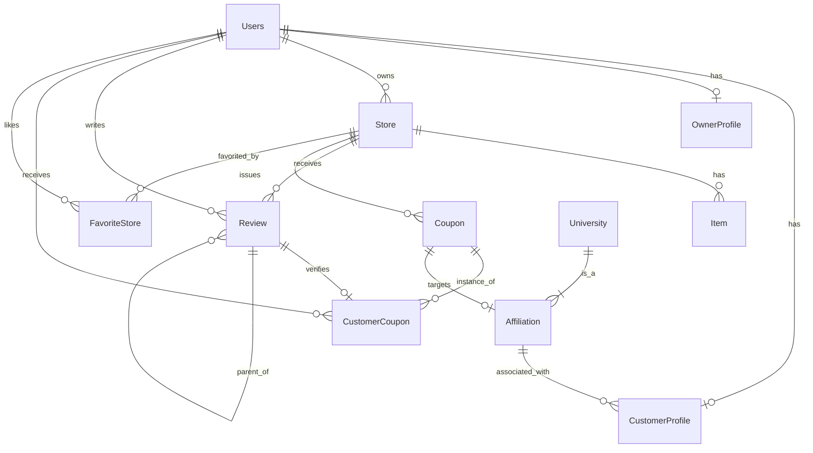

# 데이터베이스 스키마 (Database Schema)

## 1. ER 다이어그램 (Mermaid)

## 2. 테이블 정의

### 2.1 Users (`users`)
| 컬럼명 | 타입 | 제약조건 | 설명 |
| :--- | :--- | :--- | :--- |
| `user_id` | BIGINT | PK, Auto Inc | 사용자 식별자 |
| `username` | VARCHAR | Unique, Not Null | 로그인 ID (이메일 포맷 또는 소셜 ID) |
| `email` | VARCHAR | Unique | 실제 이메일 주소 (소셜 로그인 시 자동 수집) |
| `password` | VARCHAR | Nullable | BCrypt 암호화된 비밀번호 (로컬 로그인 전용) |
| `name` | VARCHAR | Not Null | 사용자 실명 |
| `role` | VARCHAR | Not Null (Enum) | `ROLE_GUEST`, `ROLE_CUSTOMER`, `ROLE_OWNER`, `ROLE_ADMIN` |
| `social_type` | VARCHAR | Nullable (Enum) | `KAKAO`, `GOOGLE`, `FIREBASE` 등 (소셜 로그인 시) |
| `social_id` | VARCHAR | Nullable | 소셜 서비스 제공자의 고유 식별자 |
| `phone_number`| VARCHAR | Nullable | 연락처 (가입 완료 시 필수) |

### 2.2 Store (`store`)
| 컬럼명 | 타입 | 제약조건 | 설명 |
| :--- | :--- | :--- | :--- |
| `store_id` | BIGINT | PK, Auto Inc | 상점 식별자 |
| `user_id` | BIGINT | FK -> Users | 상점 소유자 (1:N 관계) |
| `name` | VARCHAR | Not Null, Index | 상점 이름 (검색 최적화 인덱스 적용) |
| `address` | VARCHAR | Not Null | 상점 주소 |
| `store_category` | VARCHAR | Not Null (Enum) | `BAR`, `CAFE`, `RESTAURANT`, `ETC` |
| `latitude` | DOUBLE | Nullable | 위도 (지도 표시용) |
| `longitude` | DOUBLE | Nullable | 경도 (지도 표시용) |
| `operating_hours` | TEXT (LOB) | Nullable | 운영 시간 정보 (JSON String으로 저장) |
| `introduction` | TEXT (LOB) | Nullable | 상점 소개글 (대용량 텍스트) |

### 2.3 Item (`item`)
| 컬럼명 | 타입 | 제약조건 | 설명 |
| :--- | :--- | :--- | :--- |
| `item_id` | BIGINT | PK, Auto Inc | 상품 식별자 |
| `store_id` | BIGINT | FK -> Store | 소속 상점 |
| `name` | VARCHAR | Not Null | 상품 이름 |
| `price` | INT | Not Null | 상품 가격 |
| `description` | TEXT (LOB)| Nullable | 상품 설명 |
| `is_sold_out` | BOOLEAN | Default False | 품절 여부 |

### 2.4 Review (`review`)
| 컬럼명 | 타입 | 제약조건 | 설명 |
| :--- | :--- | :--- | :--- |
| `review_id` | BIGINT | PK, Auto Inc | 리뷰 식별자 |
| `store_id` | BIGINT | FK -> Store | 리뷰 대상 상점 |
| `user_id` | BIGINT | FK -> Users | 작성자 |
| `rating` | INT | Not Null | 평점 (1~5 정수) |
| `content` | TEXT (LOB)| Nullable | 리뷰 내용 |
| `parent_review_id` | BIGINT | FK -> Review | 대댓글(답글) 구조 지원 (Self-Referencing) |
| `customer_coupon_id`| BIGINT | FK -> CustomerCoupon | Unique (1:1), 구매 인증용 쿠폰 ID |
| `is_private` | BOOLEAN | Default False | 비밀 리뷰 여부 |

### 2.5 Coupon (`coupon`)
| 컬럼명 | 타입 | 제약조건 | 설명 |
| :--- | :--- | :--- | :--- |
| `coupon_id` | BIGINT | PK, Auto Inc | 쿠폰 식별자 |
| `store_id` | BIGINT | FK -> Store | 발행 상점 |
| `title` | VARCHAR | Not Null | 쿠폰명 |
| `description` | TEXT (LOB)| Nullable | 쿠폰 상세 설명 |
| `status` | VARCHAR | Not Null (Enum) | `DRAFT`, `ACTIVE`, `STOPPED`, `EXPIRED` |
| `type` | VARCHAR | Not Null (Enum) | `GENERAL`(일반), `AFFILIATION`(제휴) |
| `issue_starts_at` | DATETIME | Nullable | 발급 시작 일시 (예약 발행) |
| `issue_ends_at` | DATETIME | Nullable | 발급 종료 일시 |
| `total_quantity` | INT | Not Null | 총 발행 한도 |
| `limit_per_user` | INT | Not Null | 인당 발급 제한 수 |

### 2.6 Customer Coupon (`customer_coupon`)
| 컬럼명 | 타입 | 제약조건 | 설명 |
| :--- | :--- | :--- | :--- |
| `customer_coupon_id` | BIGINT | PK, Auto Inc | 발급된 쿠폰 식별자 |
| `coupon_id` | BIGINT | FK -> Coupon | 원본 쿠폰 타입 |
| `user_id` | BIGINT | FK -> Users | 쿠폰 소유자 |
| `is_used` | BOOLEAN | Default False | 사용 여부 |
| `used_at` | DATETIME | | 사용 일시 |

### 2.7 Affiliation (`affiliation`)
| 컬럼명 | 타입 | 제약조건 | 설명 |
| :--- | :--- | :--- | :--- |
| `affiliation_id` | BIGINT | PK, Auto Inc | 소속(제휴) 식별자 |
| `name` | VARCHAR | Not Null | 대학교/회사명 |
| `domain` | VARCHAR | | 인증용 이메일 도메인 |

## 3. 주요 특징 및 설계 고려사항

### 3.1 효율적인 데이터 저장 
- **Enum 관리**: `Role`, `StoreCategory`, `CouponStatus` 등 상태값은 `EnumType.STRING`을 사용하여 DB 상에서 가독성을 높였으며, 코드 변경에 따른 순서 의존성을 제거했습니다.
- **Large Object (LOB)**: 상점 소개(`introduction`), 운영시간(`operatingHours`), 리뷰 내용(`content`) 등 길이가 가변적이고 긴 텍스트 데이터는 `@Lob` 어노테이션을 사용하여 효율적으로 관리합니다. 특히 `operatingHours`는 유연한 구조를 위해 JSON String 형태로 저장됩니다.

### 3.2 성능 최적화 
- **지연 로딩 (FetchType.LAZY)**: 모든 `ManyToOne` 관계에 지연 로딩을 적용하여, 불필요한 조인을 방지하고 N+1 문제를 최소화했습니다. 연관 엔티티가 필요한 경우에만 프록시를 초기화하여 메모리와 DB 부하를 줄입니다.
- **인덱싱 (Indexing)**: 검색 빈도가 높은 `Store` 테이블의 `name` 컬럼에 `@Index(name = "idx_store_name")`를 적용하여, 상점 검색 시 Full Scan을 방지하고 조회 성능을 최적화했습니다.

### 3.3 무결성 및 확장성
- **구매 인증 리뷰**: `Review` 테이블은 `CustomerCoupon`과 1:1 관계(`unique = true`)를 맺어, 실제 쿠폰 사용자(구매자)만이 검증된 리뷰를 남길 수 있는 구조를 설계했습니다.
- **계층형 댓글**: `parent_review_id`를 통해 자기 참조 관계를 맺어, 리뷰에 대한 답글(대댓글) 작성이 가능한 계층형 구조를 지원합니다.
- **감사 (Auditing)**: 모든 엔티티는 `BaseEntity`를 상속받아 `created_at`(생성일), `updated_at`(수정일)이 자동으로 관리되며, 이는 운영 및 데이터 추적에 필수적인 정보를 제공합니다.
